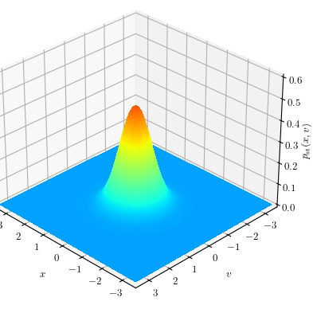

# PathIntegrationMethod.jl

[](https://travis-ci.com/HTSykora/PathIntegrationMethod.jl)
[](https://ci.appveyor.com/project/HTSykora/PathIntegrationMethod-jl)
[](https://codecov.io/gh/HTSykora/PathIntegrationMethod.jl)

This package implements the step matrix multiplication path integration (SMM-PI) method for the computation of the response probability function of a system described by a $d$-dimensional stochastic differential equation of the form

$$ \mathrm{d} x  = f(x,t) \mathrm{d} t + g(x,t) \mathrm{d} W (t).$$

The central part of the formulation of the PI method is the numerical solution of the Chapman-Kolmogorov (CK) equation

$$ p(x,t_{n+1}) = \int_{\mathbb{R}^d} p(x,t_{n+1}|y,t_n) p(y,t_n)\mathrm{d} y$$

that describes the time evolution of the response PDF $p(x,t)$ between the time steps $t_n$ and $t_{n+1}$ by transforming the CK equation to a matrix multiplication. The three key elements of the computations are:
- Approximation of the transitional PDF (TPDF) $p(x,t_{n+1}|y,t_n)$
- Spatial discretisation (interpolation) of the PDF $p(x,t_n)$
- Quadrature computation of the integral

## Installation
This package yet not released, but can be installed directly from github via the Julia package manager (type `]`)

```julia
pkg> add https://github.com/HTSykora/PathIntegrationMethod.jl#master
```

## Short usage tutorial
Consider the SDE of the cubic oscillator:

$$\mathrm{d} x = v \mathrm{d}t $$

$$\mathrm{d} v = (- 2\zeta\\, v + x - \lambda\\, x^3) \mathrm{d}t + \sigma \mathrm{d} W(t).$$

First we need to define the component functions:
``` julia
using PathIntegrationMethod

f1(x,p,t) = x[2]
    function f2(x,p,t)
        ζ, λ, σ = p
        -2ζ*x[2] - x[1] + λ*x[1]^3
    end
g2(x,p,t) = p[3]

p = [0.15, 0.25,sqrt(0.075)]; # ζ, λ, σ = p
sde = SDE((f1,f2),g2,p)

```

*Currently the package assumes that the noise only affects the dynamics of the last (in this case the 2nd) coordinate. In case you need multiple noise sources please open an issue and we will implement it.*

Next, define the region of interest and the interpolation with resolutions `Nx` and `Nv`: 

```julia
xmin, xmax, Nx = -3, 3, 71
vmin, vmax, Nv = -3, 3, 71

region = (QuinticAxis(xmin,xmax,Nx), QuinticAxis(vmin,vmax,Nv))
```

We can use the following interpolations to discretise the PDF:

- Sparse interpolation (fixed number of points used during the interpolation)
  - linear (2-point): `LinearAxis`
  - cubic (4-point): `CubicAxis`
  - quintic (6-point): `QuinticAxis`
- Dense interpolations (uses all the points in the grid for the interpolation)
  - Lagrange interpolation using a Chebyshev grid: `ChebyshevAxis`
  - Trigonometric interpolation: `TrigonometricAxis`

Typically, for scalar problems ($d=1$) we recommend `ChebyshevAxis`, and for problems with $d>1$ we recommend `QuinticAxis` (or `CubicAxis`).

Next, we define the method to approximate the drift term of the numerical time stepping used for the TPDF approximation:

```julia
method = RK2(α = 2//3);
```
We can use:

- Explicit Euler step: `Euler()`
- An explicit second order Runge-Kutta step: `RK2(α = 2//3)`
  - `α = 1//2` Midpoint method
  - `α = 2//3` Ralston's method
  - `α = 1` Heun's method
- The classic fourth order Runge-Kutta step: `RK4()`

In the current implementation we can only use the Maruyama approximation ($g(x,t_n) \Delta W(t_n)$) for the diffusion term.
Due to this the computed PDF approximation can only achieve a mean square error convergence $\varepsilon_{MS} = O(\Delta t^{-1})$.
However, in the case of higher $d$ dimensions using a higher order method can reduce the error significantly (by a constant multiplier), as it can capture better the interactions between the state variables.
A general recommendation is to use a time stepping method with the same order as the dimension $d$ of the system (`Euler()` for $d = 1$, `RK2()` for $d = 2$ and `RK4()` for $d\geq 3$).

Finally, we can define the `PathIntegration` object that we will use to compute the time evolution of the response PDF of our problem:

```julia
    Δt = 0.1;
    PI = PathIntegration(sde, method, Δt, gridaxis);
```

The `PI` contains a precomputed step matrix (`PI.stepMX`) used to advance the response pdf (`PI.pdf`).
For optional and keyword arguments for the `PathIntegration` and to initialise the response PDF please refer to the help of the `PathIntegration` function:
```julia
?PathIntegration
```

To advance the PDF a single time step we can use:
```julia
advance!(PI)
```
or to compute the steady-state PDF we can advance `PI` until `PI.pdf` converges to the steady-state PDF checking it after every `check_dt` long interval.
```julia
advance_till_conv(PI,  Tmax = 50., rtol = 1e-6, check_dt = 1.)
```
We can also include a condition that the computation stops in case we reach `PI.t == Tmax`.

We can now check the values of the PDF by `PI(x,v) ≈ p(x,v,PI.t)`.
Note that if `x` or `v` lies outside of the region of interest then `PI(x,v) == 0`.

We can create an animated evolution of the PDF of the cubic oscillator Plotting the results in each time steps


We can reinitialise the response PDF with
```julia
f_init = ...
reinit_PI_pdf!(PI, f = f_init)
```
or if we want to obtain the response PDF evolution of the same system with different we can recompute step matrix in `PI`:
```julia
new_par = ...
recompute_PI!(PI::PathIntegration; par = new_par, f = nothing, Q_reinit_pdf = false, reset_t= true)
```
