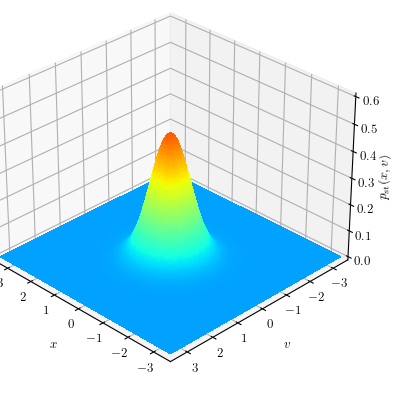

# PathIntegrationMethod.jl

[](https://travis-ci.com/HTSykora/PathIntegrationMethod.jl)
[](https://ci.appveyor.com/project/HTSykora/PathIntegrationMethod-jl)
[](https://codecov.io/gh/HTSykora/PathIntegrationMethod.jl)

This package implements the step matrix multiplication path integration (SMM-PI) method to compute the response probability density function (PDF) of a system described by a $d$-dimensional stochastic differential equation of the form

$$ \mathrm{d} x  = f(x,t) \mathrm{d} t + g(x,t) \mathrm{d} W (t).$$

The central part of the formulation of the PI method is the numerical solution of the Chapman-Kolmogorov (CK) equation

$$ p(x,t_{n+1}) = \int_{\mathbb{R}^d} p(x,t_{n+1}|y,t_n) p(y,t_n)\mathrm{d} y$$

that describes the time evolution of the response PDF $p(x,t)$ between the time steps $t_n$ and $t_{n+1}$ by transforming the CK equation to a matrix multiplication. The three key elements of the computations are:
- Approximation of the transitional PDF (TPDF) $p(x,t_{n+1}|y,t_n)$
- Spatial discretisation (interpolation) of the PDF $p(x,t_n)$
- Quadrature computation of the integral

## Installation
This package yet not released, but can be installed directly from github via the Julia package manager (type `]`)

```julia
pkg> add https://github.com/HTSykora/PathIntegrationMethod.jl#master
```

## Short usage tutorial
Consider the SDE of the cubic oscillator:

$$\mathrm{d} x = v \mathrm{d}t $$

$$\mathrm{d} v = (- 2\zeta\\, v + x - \lambda\\, x^3) \mathrm{d}t + \sigma \mathrm{d} W(t).$$

First we need to define the component functions:
``` julia
using PathIntegrationMethod

f1(x,p,t) = x[2]
function f2(x,p,t)
    ζ, λ, σ = p
    -2ζ*x[2] + x[1] - λ*x[1]^3
end
g2(x,p,t) = p[3]

p = [0.15, 0.25,sqrt(0.075)]; # ζ, λ, σ = p
sde = SDE((f1,f2),g2,p)

```

Here the noise affects the dynamics of the last (in this case the 2nd) coordinate. Independent noise sources on several of the last coordinates (diagonal noise) are given as a tuple of noise intensities, e.g. `SDE((f1, f2, f3), (g2, g3), p)` for noise on the 2nd and 3rd coordinates. The transitional PDF is then integrated over the noisy coordinates, by default with a tensor product Gauss–Hermite rule (`GaussHermiteIntegrator`) with 7 nodes in each noisy coordinate.

Next, define the region of interest and the interpolation with resolutions `Nx` and `Nv`: 

```julia
xmin, xmax, Nx = -3, 3, 71
vmin, vmax, Nv = -3, 3, 71

region = (QuinticAxis(xmin,xmax,Nx), QuinticAxis(vmin,vmax,Nv))
```

We can use the following interpolations to discretise the PDF:

- Sparse interpolation (fixed number of points used during the interpolation)
  - linear (2-point): `LinearAxis`
  - cubic (4-point): `CubicAxis`
  - quintic (6-point): `QuinticAxis`
- Dense interpolations (uses all the points in the grid for the interpolation)
  - Lagrange interpolation using a Chebyshev grid: `ChebyshevAxis`
  - Trigonometric interpolation: `TrigonometricAxis`

Typically, for scalar problems ($d=1$) we recommend `ChebyshevAxis`, and for problems with $d>1$ we recommend `QuinticAxis` (or `CubicAxis`).

Next, we define the method to approximate the drift term of the numerical time stepping used for the TPDF approximation:

```julia
method = RK2(α = 2//3);
```
We can use:

- Explicit Euler step: `Euler()`
- An explicit second order Runge-Kutta step: `RK2(α = 2//3)`
  - `α = 1//2` Midpoint method
  - `α = 2//3` Ralston's method
  - `α = 1` Heun's method
- The classic fourth order Runge-Kutta step: `RK4()`

In the current implementation we can only use the Maruyama approximation ($g(x,t_n) \Delta W(t_n)$) for the diffusion term.
Due to this the error of the computed PDF converges only with first order, $O(\Delta t)$ (the weak order of the Maruyama approximation), regardless of the drift approximation.
However, in the case of higher $d$ dimensions using a higher order method can reduce the error significantly (by a constant multiplier), as it can capture better the interactions between the state variables.
A general recommendation is to use a time stepping method with the same order as the dimension $d$ of the system (`Euler()` for $d = 1$, `RK2()` for $d = 2$ and `RK4()` for $d\geq 3$).

For each grid point, the start points of the time steps are found by a Newton iteration compiled from symbolic derivatives (the default, `backtracing = NewtonBacktracing()`). Two alternatives compute them explicitly, with a drift step backward in time (without symbolic computation, so the drift may also branch on the state):

- `backtracing = ExplicitBacktracing()`: the same results with `RK2()` and `RK4()`, and a 2–3.5× faster computation of the step matrix
- `backtracing = StrangSplitting()`: Strang splitting of the time step into the transport by the drift and the diffusion. With `RK2()` or `RK4()` and additive noise the error converges with $O(\Delta t^2)$, so much larger time steps give the same accuracy.

```julia
PI = PathIntegration(sde, RK4(), Δt, region...; backtracing = StrangSplitting());
```

Finally, we can define the `PathIntegration` object that we will use to compute the time evolution of the response PDF of our problem:

```julia
Δt = 0.1;
PI = PathIntegration(sde, method, Δt, region...);
```

The `PI` contains a precomputed step matrix (`PI.stepMX`) used to advance the response pdf (`PI.pdf`).
If Julia is started with several threads (e.g. `julia -t auto`), the rows of the step matrix are computed in parallel.
For optional and keyword arguments for the `PathIntegration` and to initialise the response PDF please refer to the help of the `PathIntegration` function:
```julia
?PathIntegration
```

To advance the PDF a single time step we can use:
```julia
advance!(PI)
```
or to compute the steady-state PDF we can advance `PI` until `PI.pdf` converges to the steady-state PDF checking it after every `check_dt` long interval.
```julia
advance_till_converged!(PI; rtol = 1e-6, check_dt = 1., Tmax = 50.)
```
The computation also stops when it reaches `PI.t == Tmax`.
The steady-state PDF can also be computed directly as the eigenvector of the step matrix that corresponds to the eigenvalue closest to 1, which is usually faster:
```julia
PI, info = steady_state!(PI)
```
In this example `steady_state!` warns that several eigenvalues are near 1: the noise is weak, so the transitions between the two potential wells are rare, and a PDF that is not symmetric converges to the steady state very slowly (the steady state is also sensitive to small errors of the step matrix).

We can now access the (interpolated) values of the PDF $p(x,v,$`PI.t`$)$ by using `PI(x,v)`.
Note that if `x` or `v` lies outside of the region of interest then `PI(x,v) == 0`.

We can reinitialise the response PDF with
```julia
f_init(x, v) = exp(-(x^2 + v^2) / 2)
reinit_PI_pdf!(PI, f_init)
```
(`f_init` does not need to be normalised), or if we want to obtain the response PDF evolution of the same system with different parameters we can recompute the step matrix in `PI`:
```julia
new_par = [0.2, 0.25, sqrt(0.075)]
recompute_PI!(PI; par = new_par, Q_reinit_pdf = true)
```
With `Q_reinit_pdf = true` the response PDF is also reinitialised (with the function given by the keyword argument `f`, or with the default initial PDF if `f = nothing`).


